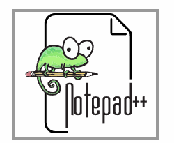

# imp-big-data-input
Empezamos con ejercicios y apuntes

## Hasta la fecha llevas 21 Sesiones
La sesión 6 y 7 son ya de ejercicios despues de las sesiones de instalaciones.

---

---

### 💖 Patrocinadores

Queremos agradecer a nuestros increíbles patrocinadores por hacer posible este proyecto:

|  |  |
| :-: | :-: |
| **Nombre Usuario 1** | **Nombre Usuario 2** |

---
What is Notepad++ ?
===================

  

&nbsp;&nbsp;&nbsp;&nbsp;
&nbsp;&nbsp;&nbsp;&nbsp;
---

See the [Notepad++ official site](https://notepad-plus-plus.org/) for more information.

Notepad++ es un editor de código fuente gratuito (como en "libre expresión" y también en "cerveza gratis") y sustituto de Notepad que soporta varios lenguajes de programación. Ejecutándose en el entorno MS Windows, su uso está regulado por la Licencia Pública General GNU.
Al usar menos potencia de la CPU, el PC puede reducir la velocidad y reducir el consumo energético, lo que resulta en un entorno más ecológico.
