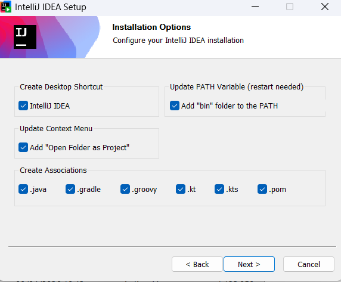

# 💻Clase 04 - Instalaciones

---

# 🚀 Tutorial 1 : Instalar Scala + IntelliJ IDEA Community + sbt en Windows 11

---

# 💻 1. Instalar IntelliJ IDEA Community

## Paso 1

Descargar IntelliJ IDEA Community desde la web oficial de JetBrains:

[Download IntelliJ IDEA](https://www.jetbrains.com/idea/download/?section=windows)

## Paso 2

Ejecutar el instalador y seguir los pasos:

- Next → Next → Install
- Activar opción: "Add launchers dir to PATH" (opcional)
- Finalizar instalación
    
    
    
    
    
    
    
    
    
    Pulsar en skip Import
    
    
    
    
    

---

# 🔌 3. Instalar plugin de Scala

## Paso 1 :

Pulsar en Plugins:


En la barra de búsqueda 🔍 escribir Scala y seleccionar la de JetBrains y luego pulsas en instalar:


Una vez instalada cierra IntelliJ.

---

# ☕ 4. Instalar JDK (Java)

## Paso 1

Descargar JDK 17 (recomendado), lo puedes hacer desde aqui:

[Descarga de Microsoft Build de OpenJDK](https://learn.microsoft.com/es-es/java/openjdk/download)

Buscar la versión 17 para Windows:


Pulsar en el enlace para descargar el ejecutable.
Una vez descargado pulsas sobre el archivo con el botón derecho del ratón y ejecutar como administrador:
 


Seleccionar: **Instalar para todos los usuarios (Recomendado)**:


## Paso 2

Instalar normalmente, pulsando en siguiente:


Una vez completado, pulsar en finalizar:


## Paso 3

Verificar instalación en terminal ( puede ser powershell)

```bash
java -version
```

Debería verse esto:


<aside>
💡

Si no te aparece la versión 17, 


hay que cambiar el PATH. Escribe:

```bash
where.is java 
```

Si esto no funciona, escribe:

```bash
echo $env:PATH
```


O buscas en tu equipo:

```bash
C:\Program Files\Java\
```

o tambien en: C:\Program Files\Microsoft

Deberías ver algo como:

```bash
jdk-17.x.x
```

Dentro habrá:

```bash
bin\java.exe
```

Añádelo al PATH:

Pulsa:

```bash
Win + S
```

Escribe: **variables de entorno del sistema:**

Abre: **Editar las variables de entorno del sistema**


Click en:
👉 **Variables de entorno**

En "Variables del sistema":
👉 selecciona `Path`


Click en:
👉 **Editar**

Subir al top, y luego Aceptar, Aceptar y Aceptar


Reiniciar PowerShell (cerrar y abrir de nuevo la terminal).

Vuelve a verificar con `where.exe java` y ya deberia aparecer java 17:


escribe `java -version` :


</aside>

# ⚙️ 5. Instalar sbt

## Paso 1: Ir a

[Install](https://www.scala-lang.org/download/)

## Paso 2

Instalar usando Coursier (recomendado):


Descomprimir y ejecutar:


Te  preguntará si quieres que añada Coursier al PATH:


Escribir Y y luego Enter:


Enter de nuevo:


Cierra todas las terminales.

Abre de nuevo PowerShell y escribe:

```bash
sbt --version
```


> Si no funciona es porque  **Coursier no ha dejado `sbt` disponible en el PATH**, o **la instalación no terminó**.
En Powershell ejecuta:
> 
> 
> ```bash
> cs version
> ```
> 
> 
> 
> El problema es el PATH de Coursier.
> 
> - Comprueba si existe la carpeta de ejecutables de Coursier:
> 
> ```bash
> Get-ChildItem "$env:USERPROFILE\AppData\Local\Coursier\data\bin"
> ```
> 
> 
> 
> Todo está instalado correctamente. El problema está en el PATH.
> 
> Añade Coursier al PATH manualmente, la ruta que debe estar en PATH debe ser similar a esta:
> 
> ```bash
> C:\Users\rodba\AppData\Local\Coursier\data\bin
> ```
> 
> - Abre:
> 👉 Variables de entorno
> - Edita en **variables de usuario**
> 👉 `Path`
>     
>     
>     
> - Añade:
>     
>     ```bash
>     C:\Users\rodba\AppData\Local\Coursier\data\bin
>     ```
>     
> - 👉 (no hace falta arriba del todo, pero mejor arriba)
>     
>     
>     
>     
>     
> - Guardar TODO.
>     
>     👉 Cierra PowerShell
>     
>     👉 Ábrelo de nuevo
>     
> - Ahora ejecuta:
>     
>     ```bash
>     cs version
>     ```
>     
>     
>     
> - Ejecuta:
>     
>     ```bash
>     sbt --version
>     ```
>     
>     
>     

# 🏗️ 6. Crear proyecto Scala con sbt

## Paso 1

Abrir IntelliJ IDEA

## Paso 2

Pulsa en: `New Project`


## Paso 3

Seleccionar: `Scala`


## Paso 4

Elegir `Build system: sbt`


## Paso 5

Configurar:

- Name: `HolaScala`
- JDK: seleccionar JDK instalado
- Scala version: dejar por defecto
- sbt version: dejar por defecto
    
    
    

Click en: `Create`

## Paso 6

Esperar a que descargue dependencias

---

# 📁 7. Estructura del proyecto

```
HolaScala/
├── build.sbt
├── project/
└── src/
    └── main/
        └── scala/
```


---

# ✍️ 8. Crear primer programa

## Paso 1

Ir a `src/main/scala`


## Paso 2

Crear archivo `Main.scala`:


## Paso 3

Añadir código:

```scala
object Main {
  def main(args: Array[String]): Unit = {
    println("Hola, Scala desde IntelliJ + sbt")
  }
}
```


Borra package Main


Borrar carpeta Main


Deja la estructura así:

```bash
src/main/scala/Main.scala
```


# ▶️ 9. Ejecutar el programa

## Opción 1 (recomendada)

Click derecho sobre `Main.scala`:

```
Run 'Main'
```


## Resultado esperado:

```
Hola, Scala desde IntelliJ + sbt
```


---

# 🧪 10. Ejecutar con sbt

## Paso 1

Abrir terminal en IntelliJ

## Paso 2

Ejecutar:

```bash
sbt run
```


---

---

---

# 🚀 Tutorial 2: Ejecutar Scala en VS Code usando el mismo entorno Java del tutorial 1

# 1. Requisitos previos

Antes de empezar, en **PowerShell** verifica que el entorno del tutorial 1 sigue funcionando.

## Comprobar Java

```powershell
java -version
```

**Resultado esperado:** debe aparecer **Java 17**.

Ejemplo:

```
openjdk version "17.0.18"
```

## Comprobar sbt

```powershell
sbt --version
```

**Resultado esperado:** debe aparecer la versión de sbt runner.

Ejemplo:

```
sbt runner version: 1.12.9
```

---

# 2. Qué vamos a instalar ahora

Para usar Scala en VS Code necesitas:

- **Visual Studio Code**
- **Scala (Metals)**
- un proyecto Scala con **sbt**

---

# 3. Instalar Visual Studio Code

## Paso 1

Descarga e instala **Visual Studio Code** para Windows 11.

## Paso 2

Abre VS Code.

---

# 4. Instalar la extensión de Scala

La forma más habitual de trabajar con Scala en VS Code es usando **Metals**.

## Paso 1

Abre la sección de extensiones.

Atajo:

```
Ctrl + Shift + X
```

## Paso 2

Busca:

```
Scala (Metals)
```

## Paso 3

Instala la extensión.

# 5. Verificar Java y sbt dentro de VS Code

Es importante comprobar que VS Code ve el mismo entorno que ya configuraste en Windows.

## Paso 1

Abre una terminal en VS Code:

```
Terminal > New Terminal
```

## Paso 2

Ejecuta:

```powershell
java -version
```

## Paso 3

Ejecuta:

```powershell
sbt --version
```

Si ambos comandos funcionan también dentro de VS Code, el entorno está correcto.

---

# 6. Crear la carpeta del proyecto

## Paso 1

Crea una carpeta para el proyecto, por ejemplo:

```
C:\Users\rodba\OneDrive\Escritorio\test_\HolaScalaVSCode
```

## Paso 2

En VS Code abre esa carpeta:

```
File > Open Folder
```

Selecciona `HolaScalaVSCode`.

---

# 7. Crear la estructura correcta del proyecto

La estructura mínima correcta debe quedar así:

```
HolaScalaVSCode/
├── build.sbt
└── src/
    └── main/
        └── scala/
            └── Main.scala
```

## Importante

La estructura debe ser exactamente esa.

## No hagas esto

```
src/main/scala/Main/Main.scala
```

porque esa carpeta `Main` hace que luego aparezcan avisos de paquetes en VS Code o IntelliJ.

---

# 8. Crear el archivo `build.sbt`

En la raíz del proyecto crea el archivo:

```
build.sbt
```

Contenido recomendado:

```scala
scalaVersion := "3.3.7"
```

## Importante

No uses:

```scala
scalaVersion := "3.3.3"
```

porque Metals muestra un aviso indicando que esa versión es antigua (*legacy*) y recomienda usar al menos Scala **3.3.7**.

---

# 9. Crear el archivo `Main.scala`

Dentro de:

```
src/main/scala
```

crea el archivo:

```
Main.scala
```

Contenido:

```scala
object Main {
  def main(args: Array[String]): Unit = {
    println("Hola Scala desde VS Code")
  }
}
```

---

## Corrección 1: el nombre del archivo debe coincidir con el objeto principal

Debe ser:

```
Main.scala
```

y dentro:

```scala
object Main
```

---

# 10. Dejar que Metals configure el proyecto

Cuando VS Code detecte el proyecto Scala, normalmente aparecerán mensajes como:

- **Import build**
- **Enable Metals**
- **Restart build server**

## Qué hacer

Acepta las opciones recomendadas.

Luego espera a que termine la importación.

La primera vez puede tardar un poco.

---

# 11. Compilar el proyecto

Antes de ejecutar, compila el proyecto desde la terminal de VS Code.

```powershell
sbt compile
```

## Resultado esperado

Debe aparecer algo parecido a esto:

```
[info] compiling ...
[success]
```

## Qué comprobar

- que no haya errores
- que se cree la carpeta `target/`

Si existe `target/`, es buena señal.

---

# 12. Ejecutar el proyecto

Ahora ejecuta:

```powershell
sbt run
```

## Resultado esperado

```
Hola Scala desde VS Code
```

Si ves ese mensaje, el proyecto funciona correctamente.

---

# 13. Qué significan `sbt compile` y `sbt run`

`sbt compile` : Compila el proyecto. 

`sbt run` : Hace tres cosas:

1. carga la configuración del proyecto
2. compila si hace falta
3. ejecuta el objeto que contiene `main`

Por eso, en un curso inicial, estos son los dos comandos más importantes:

```powershell
sbt compile
sbt run
```

# 14. Salida real esperada

Una ejecución correcta puede mostrar algo parecido a esto:

```
[info] loading settings for project...
[info] set current project to holascalavscode
[info] running Main
Hola Scala desde VS Code
[success]
```

## Importante

Todo lo que aparece como:

```
[info] loading...
[info] compiling...
```

es normal en sbt.

# 15. Primer cambio de prueba

Modifica `Main.scala` así:

```scala
object Main {
  def main(args: Array[String]): Unit = {
    val nombre = "Alumno"
    println(s"Bienvenido a Scala,$nombre")
  }
}
```

Vuelve a ejecutar:

```powershell
sbt run
```

## Resultado esperado

```
Bienvenido a Scala, Alumno
```

---

# 🚀 Tutorial 3: Scala en notebooks de Jupyter sobre VS Code en Windows 11 sin usar WSL

La instalación del kernel de Scala para Jupyter se hace con **Almond**, que es un kernel de Scala para Jupyter. La documentación oficial muestra la instalación con Coursier y, una vez instalado, el kernel queda disponible en Jupyter.

---

# 🧩 1. Qué vamos a reutilizar

De los tutoriales anteriores ya deberías tener funcionando:

- **Java 17**
- **Coursier (`cs`)**
- **sbt**
- **VS Code**

Antes de seguir, abre **PowerShell** y comprueba:

```powershell
java -version
```

```powershell
cs version
```

```powershell
sbt --version
```

Si los tres comandos funcionan, puedes continuar.

---

# 🧩 2. Qué vamos a instalar ahora

Para usar Scala en notebooks sobre VS Code necesitas estas piezas:

1. **Python**
2. **Jupyter**
3. **extensión Jupyter de VS Code**
4. **kernel Almond para Scala**

VS Code tiene soporte oficial para notebooks Jupyter mediante su extensión Jupyter. 

---

# 🧩 3. Verificar Python en Windows

## Paso 1

En PowerShell ejecuta:

```powershell
python --version
```

Si no funciona, prueba:

```powershell
py --version
```

## Paso 2

Comprueba también `pip`:

```powershell
pip --version
```

Si Python no está instalado, instala una versión actual para Windows antes de seguir.

---

# 🧩 4. Instalar Jupyter

## Paso 1

En PowerShell ejecuta:

```powershell
pip install jupyterlab notebook
```

## Paso 2

Comprueba que Jupyter quedó bien instalado:

```powershell
jupyter --version
```

---

# 🧩 5. Instalar la extensión Jupyter en VS Code

## Paso 1

Abre VS Code.

## Paso 2

Ve a extensiones con:

```
Ctrl + Shift + X
```

## Paso 3

Busca e instala:

```
Jupyter
```

Con esa extensión, VS Code puede abrir, editar y ejecutar notebooks Jupyter. 

---

# 🧩 6. Instalar el kernel de Scala para Jupyter

El kernel que vamos a usar es **Almond**.

La documentación oficial de Almond indica una instalación con Coursier y muestra el comando `launch ... almond ... --install`; una vez instalado, el kernel queda disponible en Jupyter. 

## Paso 1

En PowerShell ejecuta:

```powershell
cs launch --use-bootstrap almond -- --install
```

## Paso 2

Espera a que termine la instalación.

## Paso 3

Comprueba que el kernel aparece en Jupyter:

```powershell
jupyter kernelspec list
```

Deberías ver un kernel llamado algo parecido a:

```
scala
```

La documentación de Almond también indica que el kernel puede desinstalarse con:

```powershell
jupyter kernelspec remove scala
```

---

# 🧩 7. Si falla el comando de Almond

En algunos entornos, el lanzador necesita especificar explícitamente la clase principal. Si el comando anterior fallara, prueba con esta variante:

```powershell
cs launch --use-bootstrap almond -M almond.ScalaKernel -- --install
```

Esta alternativa aparece reflejada en documentación y discusiones del proyecto cuando el comando sin `-M` no resuelve bien la clase principal. 

---

# 🧩 8. Crear una carpeta de trabajo

Crea una carpeta, por ejemplo:

```
C:\Users\rodba\OneDrive\Escritorio\ScalaJupyterVSCode
```

Después ábrela en VS Code:

```
File > Open Folder
```

---

# 🧩 9. Crear un notebook nuevo en VS Code

## Paso 1

En VS Code crea un nuevo archivo notebook:

```
File > New File
```

Guárdalo con extensión:

```
hola_scala.ipynb
```

## Paso 2

VS Code mostrará la interfaz de notebook.

## Paso 3

En la parte superior derecha, selecciona el **kernel**. Debes elegir el kernel de Scala instalado por Almond, normalmente con nombre parecido a:

```
Scala
```

---

# 🧩 10. Primer notebook Scala

En la primera celda escribe:

```scala
println("Hola Scala desde Jupyter en VS Code")
```

Ejecuta la celda.

## Resultado esperado

```
Hola Scala desde Jupyter en VS Code
```

Si ves esa salida, ya tienes Scala funcionando en notebook.

---

# 🧩 11. Segundo ejemplo: variables y operaciones

En otra celda escribe:

```scala
val nombre = "Alumno"
val edad = 25
println(s"Hola$nombre, tienes$edad años")
```

## Resultado esperado

```
Hola Alumno, tienes 25 años
```

---

# 🧩 12. Tercer ejemplo: colecciones

En otra celda escribe:

```scala
val numeros = List(1, 2, 3, 4, 5)
val cuadrados = numeros.map(n => n * n)
println(cuadrados)
```

## Resultado esperado

```
List(1, 4, 9, 16, 25)
```

---

# 🧩 18. Primer bloque de ejercicios sugeridos

## Ejercicio 1

Crear una celda que imprima tu nombre.

```scala
println("Juan")
```

## Ejercicio 2

Crear dos variables numéricas y mostrar su suma.

```scala
val a = 10
val b = 20
println(a + b)
```

## Ejercicio 3

Crear una lista y mostrar sus elementos multiplicados por 2.

```scala
val datos = List(2, 4, 6)
println(datos.map(_ * 2))
```

---
